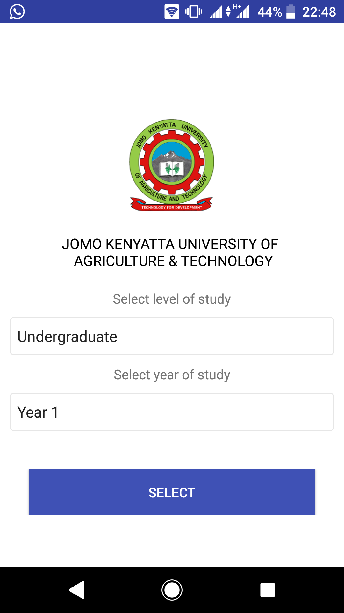
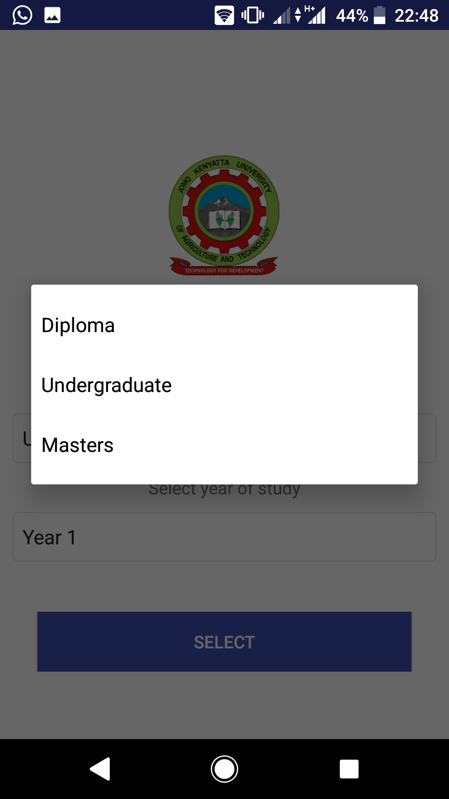
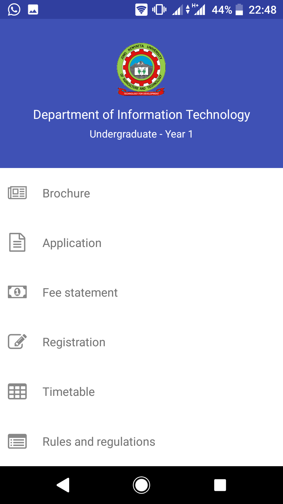
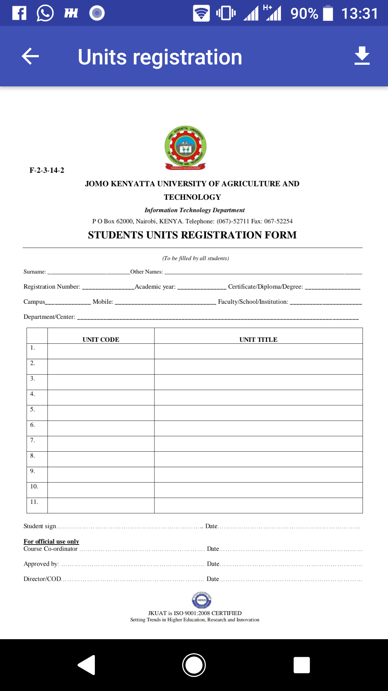
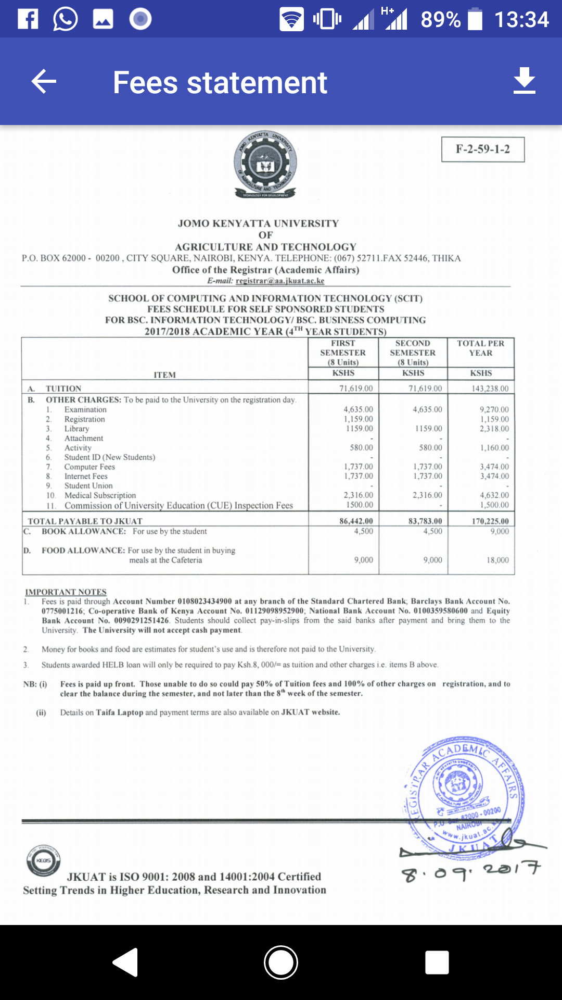

# JKUAT (Department of Information Technology)

This is a sample app for the Jomo Kenyatta University of Agriculture and Technology IT department. It contains information for the 3 levels of study available:
1. Diploma level
2. Undergraduate level
3. Masters level

Through the app, users can obtain and download information pertaining to the department i.e
* Brochure for the department
* Application form to the join the university for the DIT courses
* Fee statements for all levels of study
* Registration forms for semester units in the various levels of study
* Timetables for all the classes available at the various levels of study
* Rules and regulations of the department

### Screenshots

